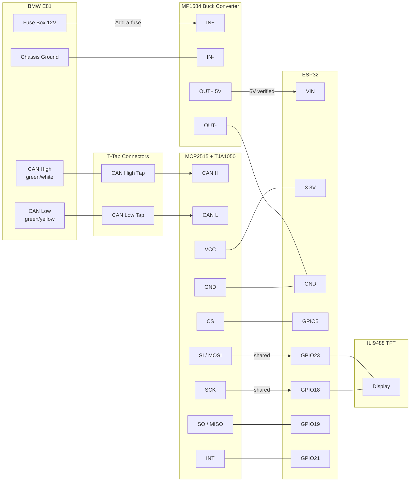

# Wiring — Direct CAN Bus (MCP2515)

## v1.0: Replaces ELM327 + CP2102 entirely

### MCP2515 → ESP32

| MCP2515 Pin | ESP32 Pin |
|---|---|
| VCC | 3.3V |
| GND | GND |
| CS | GPIO5 |
| SCK | GPIO18 (shared with TFT) |
| SI (MOSI) | GPIO23 (shared with TFT) |
| SO (MISO) | GPIO19 |
| INT | GPIO21 |

### CAN bus wire colours in BMW E81

- **CAN High** — green/white wire
- **CAN Low** — green/yellow wire
- **Location:** behind instrument cluster, or along door sill wiring loom

### Power wiring (v1.1 hardwired install)

1. Pull existing mini fuse from E81 glovebox fuse box
2. Insert add-a-fuse — original fuse in top slot, new 5A fuse in bottom slot
3. Red wire from add-a-fuse → MP1584 IN+
4. Black wire from chassis ground → MP1584 IN-
5. Adjust MP1584 trimmer pot until OUT+ reads exactly 5.0V (measure with multimeter)
6. MP1584 OUT+ → ESP32 VIN pin
7. MP1584 OUT- → ESP32 GND

> **WARNING:** Always verify buck converter output voltage with a multimeter BEFORE connecting to ESP32.
