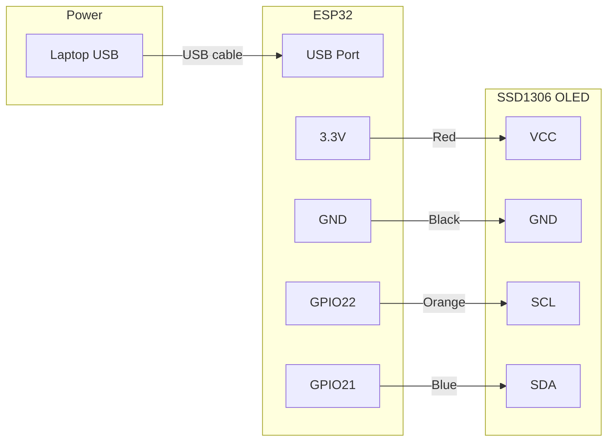
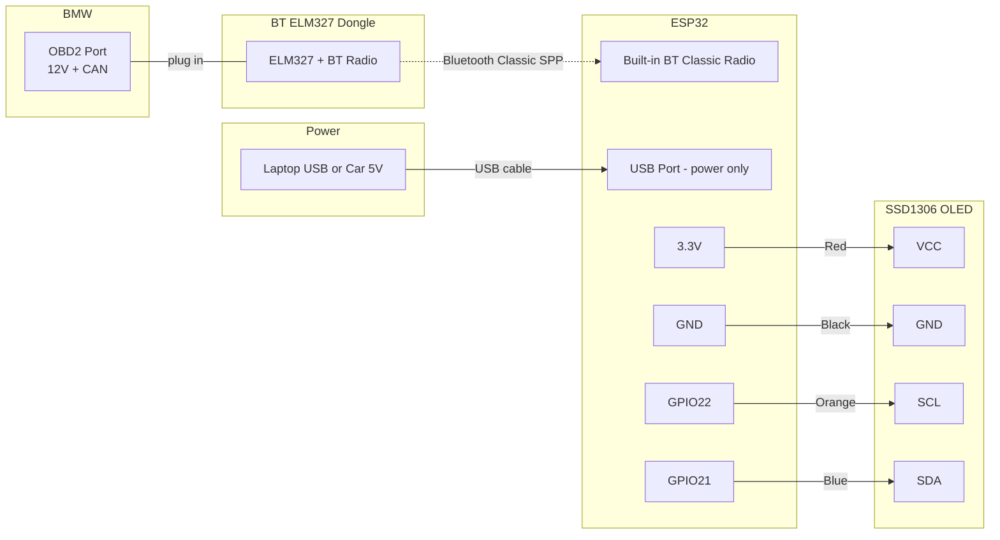

# Wiring — OLED Display

## v0.1: OLED Fake Data (no OBD needed)

### 0.96" SSD1306 OLED (LAFVIN kit) → ESP32

Board pin order: GND VCC SCL SDA (left to right)

| OLED Pin | ESP32 Pin | Wire colour |
|---|---|---|
| GND | GND | Black |
| VCC | 3.3V | Red |
| SCL | GPIO22 | Orange |
| SDA | GPIO21 | Blue |

**Power source:** Laptop USB → ESP32 USB port. Powers everything. No external power needed.



> **WARNING:** Always check labels on YOUR board before wiring — pin order varies by manufacturer.

---

## v0.2: OLED + Real OBD Data (Bluetooth ELM327)

> **DO NOT BUY A USB-STYLE ELM327 CABLE.**
> The ESP32 dev board's USB port is for flashing and power only — it cannot act as a USB host. A USB-style ELM327 cable needs to plug into a host (like a laptop). A female-to-female USB adapter between the cable and the ESP32 does **nothing** electrically and will not work. You also do **not** need a CP2102 / USB-to-UART bridge.
>
> **Buy a Bluetooth ELM327 dongle instead.** It plugs directly into the car's OBD2 port and talks to the ESP32 wirelessly over Bluetooth Classic.

### How it works

An ELM327 Bluetooth dongle plugs into the car's OBD2 port and broadcasts a **Bluetooth Classic SPP** (Serial Port Profile) radio link. The ESP32 has built-in Bluetooth — it pairs with the dongle and opens a virtual serial stream. The `ELMduino` library treats that stream exactly like a hardware UART, so all OBD2 query code from v0.1 can be reused unchanged.

No soldering. No UART tap. No voltage divider. No CP2102. No opening any housings.

### Shopping list

| Part | Notes |
|---|---|
| Bluetooth ELM327 dongle | Must be Bluetooth **Classic** (SPP). Most cheap dongles on Amazon are. Avoid WiFi-only or iOS-only BLE models. Look for firmware ELM327 v1.5 or v2.1. |
| ESP32 DevKit (already have it) | Built-in Bluetooth Classic — no extra module needed. |
| SSD1306 OLED (v0.1 wiring unchanged) | Same I²C wiring as v0.1. |

Named brands (Vgate iCar, OBDLink LX, KIWI 3) are reliable. €10–€30 generic dongles work but pairing can be finicky.

### Wiring (OLED unchanged from v0.1)

Exactly the same as v0.1 — only the data source changes, not the hardware wiring:

| OLED Pin | ESP32 Pin | Wire colour |
|---|---|---|
| GND | GND | Black |
| VCC | 3.3V | Red |
| SCL | GPIO22 | Orange |
| SDA | GPIO21 | Blue |

### Bluetooth link



### Pairing procedure

1. Plug the BT ELM327 dongle into the car's OBD2 port
2. Turn ignition to **accessory** (key position 1) so the OBD bus is powered
3. From a phone, pair to the dongle once — note the **Bluetooth name** (usually `OBDII`, `OBD2`, or `V-LINK`). Most cheap dongles use "Just Works" pairing with no PIN.
4. Put that name into the ESP32 sketch as `ELM_NAME`
5. On boot, the ESP32 scans for that name, connects, and opens the serial stream

> **NOTE:** Name-based pairing is the simplest path for cheap dongles. If your dongle has the same name as a common model, you can also connect by MAC address via `SerialBT.connect(macAddr)`. Find the MAC on macOS / Linux via `hcitool scan` or `bluetoothctl`.

### Code sketch — ELMduino over BluetoothSerial

This is the real `v0.2_oled_real_obd.ino` pattern — what the project actually uses:

```cpp
#include <BluetoothSerial.h>
#include <ELMduino.h>

BluetoothSerial SerialBT;
#define ELM_NAME "OBDII"    // change to match your dongle's BT name
ELM327 myELM327;

void setup() {
  Serial.begin(115200);

  SerialBT.begin("BMW_DASH", true);          // master mode
  if (!SerialBT.connect(ELM_NAME)) {
    Serial.println("BT pair failed");
    return;
  }

  if (!myELM327.begin(SerialBT, false, 2000)) {
    Serial.println("ELM327 init failed");
    while (true);
  }
  Serial.println("ELM327 ready");
}

void loop() {
  float rpm = myELM327.rpm();
  if (myELM327.nb_rx_state == ELM_SUCCESS) {
    Serial.printf("RPM: %.0f\n", rpm);
  }
}
```

The full sketch at `sketches/v0.2_oled_real_obd/v0.2_oled_real_obd.ino` adds a non-blocking poll schedule (RPM polled more often than oil temp), auto-rotating OLED screens, and reconnect-on-error logic.

### Power

- **Dev:** laptop USB → ESP32 USB port (same as v0.1)
- **In-car (v1.1+):** MP1584 buck converter from fuse box 12V → 5V → ESP32 VIN

> **NOTE:** ESP32 Bluetooth Classic uses around 45 KB RAM. Plenty of headroom on the stock ESP32 DevKit, but ESP32-C3 / -S2 only have BLE — no Classic — and most ELM327 dongles speak Classic.
