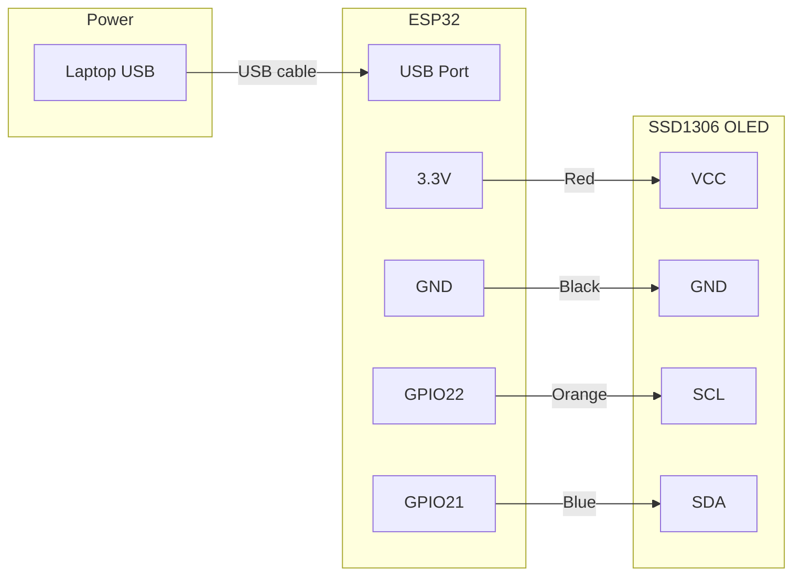
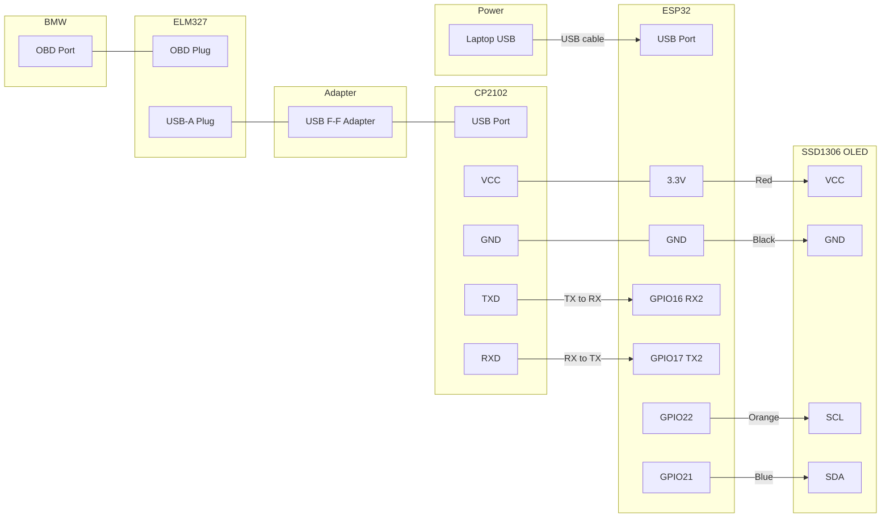

# Wiring — OLED Display

## v0.1: OLED Fake Data (no OBD needed)

### 0.96" SSD1306 OLED (LAFVIN kit) → ESP32

Board pin order: GND VCC SCL SDA (left to right)

| OLED Pin | ESP32 Pin | Wire colour |
|---|---|---|
| GND | GND | Black |
| VCC | 3.3V | Red |
| SCL | GPIO22 | Orange |
| SDA | GPIO21 | Blue |

**Power source:** Laptop USB → ESP32 USB port. Powers everything. No external power needed.

> **WARNING:** Always check labels on YOUR board before wiring — pin order varies by manufacturer.

---

## v0.2: OLED + Real OBD Data (ELM327 + CP2102)

### Full connection chain

| CP2102 Pin | ESP32 Pin | Notes |
|---|---|---|
| TXD | GPIO16 (RX2) | TX goes to RX — correct, not a mistake |
| RXD | GPIO17 (TX2) | RX goes to TX — correct, not a mistake |
| VCC | 3.3V | Power |
| GND | GND | Ground |

### OLED stays exactly the same as v0.1

### ELM327 USB cable
- OBD plug → BMW OBD port (under dash, driver side)
- USB-A plug → USB female-female adapter → CP2102 USB port

> **WARNING:** ELM327 must be the USB/UART version — NOT Bluetooth, NOT WiFi.
