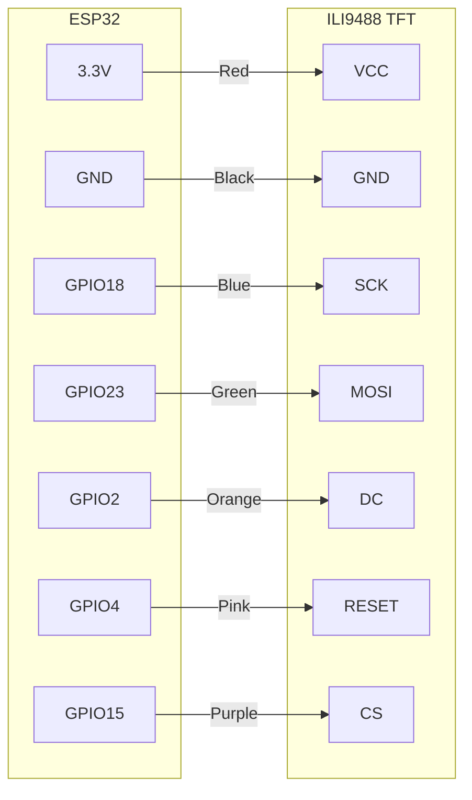

# Wiring — ILI9488 3.2" TFT Display

## v0.3 and v0.4: TFT Display

Replaces the OLED. CP2102 and ELM327 wiring stays the same for v0.4.

### ILI9488 SPI → ESP32

| TFT Pin | ESP32 Pin | Wire colour |
|---|---|---|
| VCC | 3.3V | Red |
| GND | GND | Black |
| SCK | GPIO18 | Blue |
| MOSI | GPIO23 | Green |
| DC | GPIO2 | Orange |
| RESET | GPIO4 | Pink |
| CS | GPIO15 | Purple |

### Library configuration

Libraries required:
- **TFT_eSPI** — configure `User_Setup.h` for ILI9488 and the SPI pins listed above

> **WARNING:** ILI9488 runs on 3.3V logic — matches ESP32 directly. No level shifter needed. Do NOT connect VCC to 5V.

> **WARNING:** When display arrives — check which driver chip it uses (ILI9488 or ST7789). Look on back of board. Library config differs slightly between the two.
